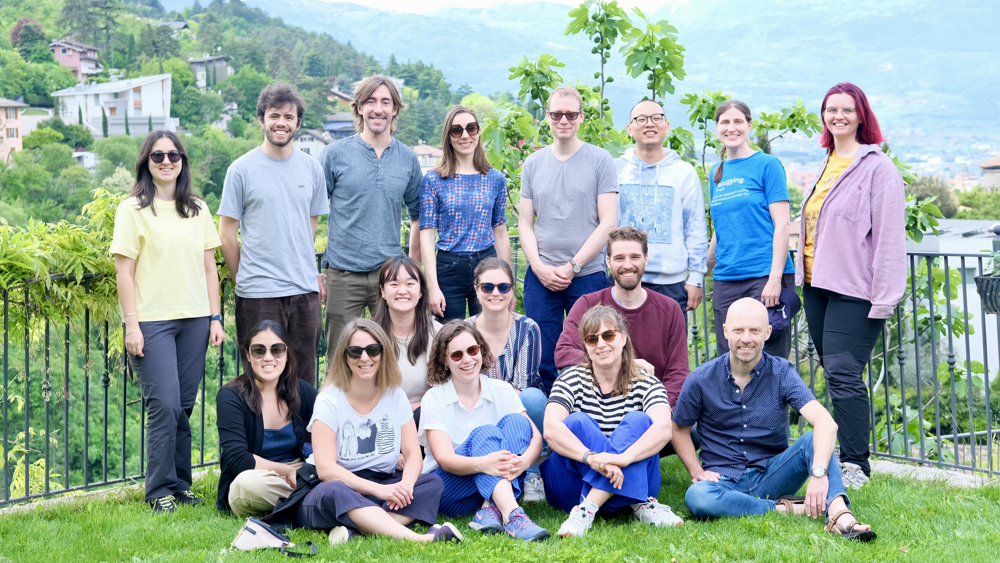

# Lab Retreat

A lab retreat is an opportunity for old and new lab members to get to know each other better and formulate scientific goals as a group. The retreats organized at the Predictive Brain Lab are usually a mixture of social and intellectual activities planned by other lab members. Here, we provide some tips and tricks on how to organize one as well as some more technical information (_e.g.,_ scheduling, budget, etc.) that might be helpful to plan the next one. 

## Tips & Tricks 

### Where, when, how long:

The lab retreat generally takes place once a year, in the first couple of months of an academic year (Sep/Oct/Nov), in the Netherlands. For example, in November 2022 the lab stayed at a location in [Berg and Dal](https://www.visitnijmegen.com/berg-en-dal). It typically lasts for two weekdays (so with one night). The example from 2024 is a bit different: we combined the lab retreat with the [CAOs conference](https://event.unitn.it/cimec-caos/) in Rovereto, Italy. Therefore, this timetable is more elaborate than most (both in time and in activities: Restaurants and wine-tasting are not a normal part of the retreat). Therefore, the timetable of the 2022 retreat is also included as an example. 
Finding and booking a suitable location needs to be done **early**. The committees of 2022 and 2024 started the first preparations about **5/6 months in advance.**

#### Who: 
Active Post-Docs, PhD candidates, interns/RAs (and the PI obviously) are expected to attend. Regarding affiliated members: discuss in advance with Floris who you are supposed to invite for the lab retreat.
Between the start preparations and the actual retreat, new lab members might join, who need to be included in the lab retreat (keep that in mind when booking a location). 
**The committee generally consists of 3 people,** preferably at least one Post-Doc and one PhD candidate (but depends a bit on how many people from each level are in the lab). 

#### What:
The lab retreat consists of several types of activities: scientific activities, non-scientific work-related activities, team building, social activities, physical (outdoor) activities (some activities are a combination of different types). 
Do **not** make the time schedule as full as the one you see in this example from 2024 and 2022. It works better if you provide a bit more free time. 

* [Schedule 2024](https://docs.google.com/spreadsheets/d/1gS0kouhGomiHJPVe9WaZ6hzc8eX1iS4q/edit#gid=1247763362)
* [Schedule 2022](https://docs.google.com/spreadsheets/d/1gS0kouhGomiHJPVe9WaZ6hzc8eX1iS4q/edit#gid=1288972896)
* [Science Activities 2024 in Detail](./Retreat_2024_science_activities.pdf)

#### Budget: 
The costs of the lab retreat are covered by Floris. Discuss the budget with him. Budget depends on many factors (lab size etc.) and everything budget-related needs to be discussed with and agreed on by Floris. 
Note that the budget for 2024 is not a good example, because the we stayed in Rovereto for 5 nights of which 2 lab retreat nights (the costs of the stay during the conference was covered with everyone’s conference budgets). The budget sheet from 2022 is also included in the example. 

* [Budget Example 2024](https://docs.google.com/spreadsheets/d/1gS0kouhGomiHJPVe9WaZ6hzc8eX1iS4q/edit#gid=853860934)
* [Budget Example 2022](https://docs.google.com/spreadsheets/d/1gS0kouhGomiHJPVe9WaZ6hzc8eX1iS4q/edit#gid=1073279397)

#### Other: 
Make a questionnaire to inquire about dietary restrictions, yes/no to alcohol, roommate preferences (in case of room sharing), and anything else you'd like to get info on from lab members (snack preferences, things for specific activities). **Share this questionnaire well in advance,** to makes sure people have time to fill it out and you have the info well in advance.
It is helpful to make a MatterMost channel for the committee to provide information to the lab and for the lab members to ask questions share. Furthermore, it helps to share and information letter with the lab with all the relevant information (e.g., two weeks before the retreat, include a packing list, important times and locations etc.), see the 2024 example. 
Consider making a backup plan for outdoor activities in case of bad weather.

* [Information Letter](./Info_letter_Retreat_Rovereto_2024.pdf)

The lab retreat is a good moment for a group picture (like the one below!). 

