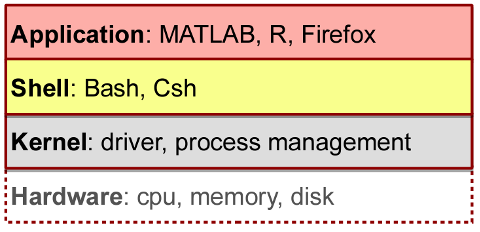
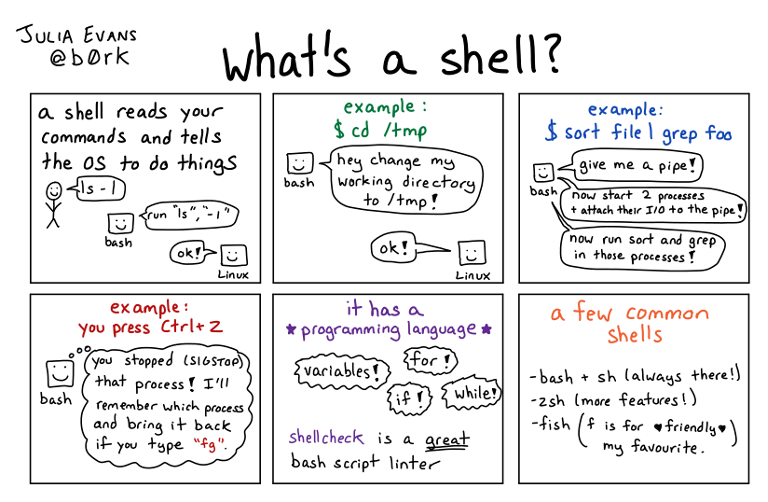

## Linux and Bash (Shell) Basics
Before describing how to use the HPC cluster it is important to familiarize yourself with Linux and Bash commands, as this is the language you will be using to send in your work.  If you are proficient with both of them, feel free to skip it and go to the section: [Using the HPC Cluster]().

{: .note }
> If you are working from a MacBook terminal, the default language will not be bash but a similar language called **zsh** (Z shell). Look online at the differences between both. You can still use bash if you use the terminal on the VNC GUI or by changing the language on your Macbook from zsh to bash. 

A very fun, easy-to-understand and useful resource to learn Linux, CLI and Bash is this series of [comics by Julia Evans](https://wizardzines.com/comics/). It simplifies concepts and helps understand how to use these tools. 

Additionally, a resource to learn shell or lab skills for research computing is [Software Carpentry](https://software-carpentry.org/lessons/).

These two links provide some concise cheat sheets for Linux and Bash:
- “Cheat Sheet for Linux” [here](https://hpc.dccn.nl/docs/linux/practice/filesystem.html). 
- “Bash Cheat Sheet” [here](https://hpc.dccn.nl/docs/bash/cheatsheet.html#cheat-sheet).

### Linux
The HPC Wiki website contains very useful information on Linux basics, providing explanations for the different commands as well as code examples. You can see those [here](https://hpc.dccn.nl/docs/linux/practice/filesystem.html).

If you want to get some hands-on practice with Linux systems before using them in your work. The HPC wiki also contains a series of tutorials to get you familiar with the environment. You can see those [here](https://hpc.dccn.nl/docs/linux/practice/exercise_fs.html). 

### Bash and Zsh (Shell)
It is not very simple to describe what bash is. However, understanding it thoroughly is not fundamental to be able to use it. In simple terms, bash or zsh are programming languages tightly integrated within the operating system (OS). Bash is both a **command-line interface (CLI)** and a **scripting language**, allowing repetitive tasks to be done automatically and quickly. With the proper commands, it can repeat tasks with or without some modification as many times as we want.



Your computer is usually organized in the manner shown in the figure above. Most of the time, users interact with applications (_e.g.,_ MATLAB) that directly connects them to the kernel and hardware without having to directly specify what to do (_ie.,_ you interact with the GUI of the app). **By using bash or zsh, you tell the kernel directly how you want your data to be processed**. While a GUI presents you with choices to select, CLI choices are not automatically presented to you – **we must learn commands!**

Familiarity with the shell (bash or zsh) is near essential to run a variety of specialized tools and resources including high-performance computing (HPC) systems. Thus, being able to interact with the shell is becoming a necessary skill for (data) science. 



In very simple terms: bash says _“Give me input from the terminal, I will process that input, tell the kernel what to do, and send output somewhere for you”._

For our specific case as members of the lab, we will give bash commands to run our (MATLAB or Python) scripts and the output will be saved somewhere (specified by us) in our files. 

The [following page](https://hpc.dccn.nl/docs/bash/start.html) from the HPC Wiki contains an introduction, example code, and tutorials on how to use BASH scripting language. 

These are a series of tips to keep in mind to get working commands:

-	Bash treats spaces, tabs, and new lines as white spaces. In this scripting language, a white space separates _words_ in bash. The first word is always a command and the following arguments. For instance: `ls -a /path/to/my/favorite/file*txt`. In this case `ls`(command) [space] `-a`(option) [space] `/path/to/my/favorite/file*txt` (operand)

-	Variables are assigned as `variable=value`. Without any spaces. 
To call for a variable, you must use `$variable`. 

-	Anything in quotes will be processed as a single word, including spaces. Single quotes remove special meaning from characters inside of them (_i.e.,_ everything between single quotes will be processed as a literal character). Double quotes only escape spaces and single quotes. 

-	Bash is case sensitive. So be careful for any typos!

-	Always check that you are specifying the correct directories for running scripts, using programs, saving output, etc. 

#### What is Bash Scripting?
Instead of directly typing bash commands one-by-one to your terminal, you can make use of scripts that include all the commands you want in a sequential order. You simply open a text editor and write your commands in there! (either by opening the text editor in the terminal or by using your VNC GUI). See [here](https://hpc.dccn.nl/docs/bash/start.html) for more info on how to use the text editor on the terminal. 

The reason why you would use this is to reduce errors, create analysis pipelines, work faster, etc. Overall, it automatizes processes and makes your work reproducible for you and other researchers. 

To use these `.txt` documents as scripts, you simply set the document as executable `$ chmod +x myscript.sh ` on the terminal and run it by simply typing its name and hitting enter `$ /path/to/my/file/myscript.sh ` 

_Note:_ For the system to read a text file as a bash command, you need to start it with `#!/bin/bash ` and use the file extension `.sh `

**For Loops and If statements in Bash**

Some of you might be familiar with **For Loops** and **If statements** from other programming languages. In Bash scripts you can also make use of these functions. 

The reason why these are helpful is because you can make use of them to run multiple scripts, functions, etc., without having to add many lines or make use of multiple scripts. They also reduce the amount of typing and can avoid small mistakes from happening. 

**In bash you can execute a list of commands for every item on a list** (this is very useful to remember!)


You can look online on how to use **For loops**, but this illustration should give you a good idea! 

**If statements** are typically employed in parallel with for loops and help to stop a loop from running once a condition has been met. 


Here, we provide a small example of an if statement and useful test operators. For more information, search on the internet. [Software carpentry](https://swcarpentry.github.io/shell-novice/) is a useful tool containing a series of lessons on how to use shell for scientific computations.

#### Transferring Files
To copy large data files between your home computer and the cluster you can use [RSync](https://rsync.samba.org/). It offers a variety of options to control the way you share your information. You can do it very easily using the terminal (shell):

```rsync -av sourcefile youruser@localhost:target address```

_We still recommend checking the website to understand better how to do these transfers._ Never copy-paste code that you do not understand fully.

Alternative options for RSync are:
-	[RClone](https://rclone.org/) (Similar to RSync but for cloud-based storage)
-	[SCP](https://www.ssh.com/academy/ssh/scp) (Secure Copy)
-	GitHub (Useful to already store scripts and documents for later reference and publication. You can setup [SSH keys](https://docs.github.com/en/authentication/connecting-to-github-with-ssh) and easily have remote folders on the server and your personal laptop.)
