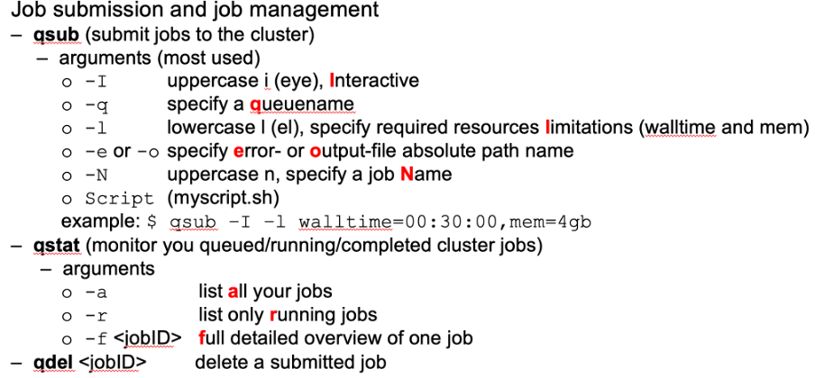

## Using the Cluster
The compute nodes at the HPC are currently managed by the **Torque resource manager**. Instead of allowing users to log in to the high-performance computer and run computations freely, users **submit** their computations in the forms of **jobs** to the Torque cluster. Here, the Torque will create a schedule and submit the work according to a series of considerations (you will have to set resource requirements and based on this the jobs (_i.e.,_ computations you want to perform) will be arranged in **job queues**). 

From a practical point of view, using the **Torque resource manager** means that you will have to learn specific commands in your CLI or the terminal of the VNC GUI to submit your work to the HPC.

{: .important }
> _The DCCN is changing from Torque manager to SLURM. This means the commands to connect to the cluster will be shortly changing. If you are new and wish to only learn SLURM you can see the HPC WIKI page for it [here](https://hpc.dccn.nl/docs/cluster_howto/compute_slurm.html). **We do NOT recommend only using SLURM as it is still in the testing phase**. **Why is the change happening?** Slurm is open source, allows for better error handling and is the new leader in HPC computing._

To get more information on the [job prioritization](https://hpc.dccn.nl/docs/cluster_howto/compute_torque.html#resource-sharing-and-job-prioritisation) and [job resource management flow](https://hpc.dccn.nl/docs/cluster_howto/compute_torque.html#job-management-workflow), you can see the highlighted pages on the HPC Wiki.

There are three key functions for the **job management** workflow:
1.	`$ qsub ` - this is to submit a job to the cluster 
2.	`$ qstat ` - this is to monitor the job status on the cluster
3.	`$ qdel ` - this is to delete a job from the cluster

To check for the output files after your job has run, you can use:
-	`$PWD/STDIN.o<JOBID> ` - to see the output of your job
-	`$PWD/STDIN.e<JOBID> ` - to see any errors that might have occured when running your job

### Job Submission

There are two main ways in which you can send job submissions to the cluster: **batch submissions and interactive submissions.** 

The main difference is that in **batch submissions** you simply tell the cluster what to do and you can go on with your life until it is done. Using **interactive submissions** means that you can either use the CLI and run your commands directly on the cluster or connect your VNC GUI to the cluster and run software (_e.g.,_ MATLAB) from there. 

This is a very brief cheat sheet on job submissions for the cluster:

To get more information on **batch submissions** you can visit [this page](https://hpc.dccn.nl/docs/cluster_howto/compute_torque.html#batch-job-submission) on the HPC wiki. If you want to have a more hands-on approach, you can access this [link](https://hpc.dccn.nl/docs/cluster_howto/exercise_simple/exercise.html) with a practical exercise for batch submissions.

Interactive job submissions can take two forms:
*	**Interactive computation in text mode**

You run a command line in your shell (terminal) and select the interactive option. This will allow you to connect to the HPC cluster and any computation you run in the shell from then onwards will be processed by the cluster.  This can be thought of as connecting the CLI to the HPC. For more information and code examples see [here](https://hpc.dccn.nl/docs/cluster_howto/compute_torque.html#interactive-computation-in-text-mode). 

*	**Interactive computation in graphic mode**

Ideally, you would like to run your software such as MATLAB or Python directly using the HPC cluster. In that way, you can do all your regular analyses using a GUI but having the HPC computational resources. This is possible with the interactive computation in graphic mode. **The important thing to remember is to be connected to the VNC GUI on your laptop**. To see how to do this, open this [page](https://hpc.dccn.nl/docs/cluster_howto/compute_torque.html#interactive-computation-in-graphic-mode).

In this [page](https://hpc.dccn.nl/docs/cluster_howto/exercise_interactive/exercise.html), you have exercises to practice interactive job submissions. 

[Here](https://hpc.dccn.nl/docs/cluster_howto/compute_torque.html#checking-job-status), you can see instructions on how to see the status of the jobs you have submitted. 

### Job Resource Requirements
Every job you submit to the cluster will have to come with resource requirements. In this way, the Torque manager can properly allocate the necessary (computing) resources for your job. In order to not run into any problems, you need to make sure that there are sufficient resources specified in your submission. 

You can visit this [page](https://hpc.dccn.nl/docs/cluster_howto/compute_torque.html#specifying-resource-requirement) to get more information on how to specify your resource requirements. 

{: .note }
> For some analyses, you might have very specific requirements on properties of the HPC cluster you want to access (e.g., you want to use cuda, gpus, etc.). **You can specify these in your resource requirements when submitting a job**. The HPC wiki link above contains more information on the different requirements you can select. 

It might be hard to estimate how many resources you require for a specific job. To make accurate estimations you can:
-	Ask other more experienced colleagues 
-	Run tests, check the [status of your job](https://hpc.dccn.nl/docs/cluster_howto/compute_torque.html#checking-job-status)
-	Run an interactive job and check VNC which shows graphical statistics-window of the running job (an estimate of the requirements)
-	Check the epilogue message at end of the output file `<job_name>.o<jobID>`

For more information on estimating resources, see [here](https://hpc.dccn.nl/docs/cluster_howto/compute_torque.html#estimating-resource-requirement). 

{: .important }
> Try to not overestimate largely the resources you need. In this way, more people can use the cluster simultaneously.  For an exercise on resource requirements, see [this page](https://hpc.dccn.nl/docs/cluster_howto/exercise_resource/exercise.html). 
