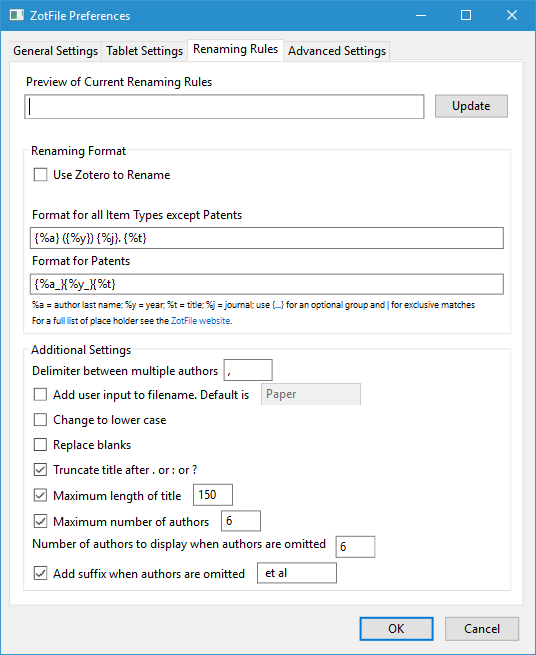

## Reference Management Tools 
### Zotero

[Zotero](https://www.zotero.org/) is a bibliography management tool that enables easy importing of citations (to papers etc.) from online sources, automatically grabs the PDF for stuff you import, and integrates with Word (or BibTeX) to manage bibliographies in your own papers. 

Installing Zotero and the corresponding browser connector on your computer is relatively straightforward and information about this can be easily found [online](https://www.zotero.org/). 

Already good on its own, Zotero really shines when you (1) instruct it to store PDFs of papers somewhere in your OneDrive Donders folder and (2) use the ZotFile plugin to automatically rename and move new attachments. Incidentally, this also means you will never run out of Zotero account storage (which can fill up very quickly with PDF attachments), since your files are all stored inside OneDrive. This page will explain how to setup Zotero in such an optimal fashion. 

{: .note }
>You will need to do all these steps exactly once on every machine on which you wish to use Zotero.

There are other reference tools besides Zotero (_e.g.,_ Mendeley), but we recommend sticking to this one.

#### Zotero and One Drive: Your Library in the Cloud

**Step 1: Instruct Zotero to store PDFs in OneDrive**
1. Open Zotero.
2. Edit -> Preferences -> Advanced -> Files and Folders
3. At 'Base directory', choose a folder that lives inside your OneDrive (you might need to create it first), e.g. "C:\Users\eelspa\OneDrive (Personal)\Zotero PDF" in my case.
4. It's recommended to leave 'Data Directory Location' untouched! Storing the actual Zotero database inside OneDrive can lead to problems, so just leave it in some local folder only (the default is fine).
5. Press OK.

**Step 2: Install Zotfile**
1. Head to http://zotfile.com/ and click the 'Download' link.
2. In Zotero, go to Tools -> Add-ons.
3. Click the gear (⚙) icon at the top right -> Install add-on from file…
4. Select the .xpi file you just downloaded from the Zotfile website.
5. Zotfile will be installed into Zotero. You may need to restart Zotero now.

**Step 3: Setup Zotfile to integrate with your OneDrive PDF folder**
1. Inside Zotero, go to Tools -> ZotFile Preferences.
2. On the tab 'General settings', section 'Location of Files', make sure 'Custom Location' is selected and have it point to the same OneDrive PDF folder you selected in step 1.3 above.

**Step 4: BONUS! Nice filenames**
1. While still in ZotFile Preferences, head to tab 'Renaming rules', make sure 'Use Zotero to Rename' is unchecked.
2. Enter the following to get sensible filenames, similar to what we're all used to in e.g. APA-compliant bibliographies:

**Step 5: Test it out!**
Make sure Zotero is running.
Head to any journal article on the web in your browser and click the "Save to Zotero" button. It should now be added to your library, the PDF should be downloaded automatically, stored in the folder you selected, and renamed according to the rules you defined in step 4.
OneDrive will take care of syncing the new file to the cloud, so you have access to your full-text library wherever you go!
