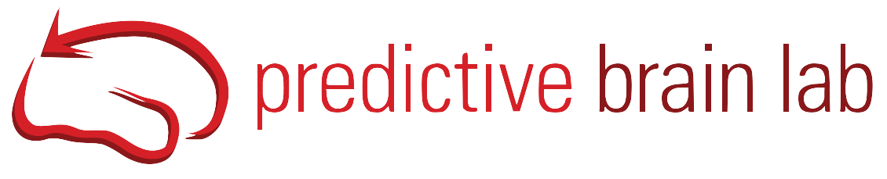

# Welcome to the Predictive Brain Lab's Wiki!

We are based at the [Donders Institue for Brain, Cognition and Behaviour](https://www.ru.nl/en/donders-institute) at [Radboud University](https://www.ru.nl/en) in Nijmegen, Netherlands. This is the lab wiki, which provides information regarding the **technical skills** relevant to perform research as part of our group. 

This wiki is the result of the efforts of the PI [Floris de Lange](https://www.predictivebrainlab.com/people/floris-de-lange) and [current and previous members of the lab](https://www.predictivebrainlab.com/people). For information regarding our team, research, and publications you can see our [website](https://www.predictivebrainlab.com/). 

The current wiki has been inspired by the work of some of our colleagues ([Anne Urai](https://anne-urai.github.io/lab_wiki/Practical.html), [Mariam Aly](https://osf.io/mdh87/wiki/Stimuli/), [Liad Mudrik](https://osf.io/5kfrc/wiki/home/), and [Steve Fleming](https://metacoglab.github.io/lab_wiki/)). Thank you for sharing your resources. 
This document is a work in progress. If you find important information missing, unclear, or outdated, please notify us or request an update! 

We hope you have a great time during your stay in the lab and that this lab wiki is useful for you!

#### The wiki is divided into the following sections:
  

#### [Lab Basics]()

If you are new to the lab, or have more general admin questions, this is the place to start. You can find a guide to the lab, guides for more general procedures ([science communication]()) and some useful links to Donders Institute resources.

* * * 
#### Standard Operating Procedures

Here you will find the lab's guidelines and pipelines for conducting and analysing [behavioural](), [fMRI]() and [M/EEG]() data, as well as some general guidelines for conducting research in the lab. 

* * * 

#### [Technical Help]()

Here you will find some technical guides (e.g. how to use the cluster), as well as links to sample code and useful resources. There is a separate section on [NeuroAI]() for those interested in diving deeper into this field. 

* * * 

### Contributing and Maintaining this Wiki

Do you have a question? Did you find outdated information? Do you have a resource you would like to share with the research group?

**See [here]() on how to contribute to the wiki!**

##### `Lastly, this website was created using the template [JustTheDocs](https://github.com/just-the-docs/just-the-docs).`
